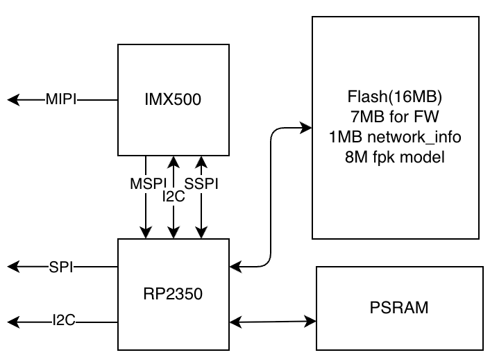
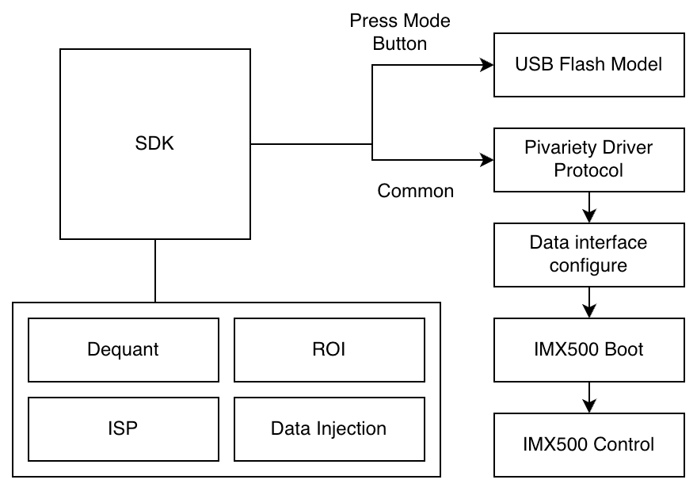

# IMX500 MCU SDK


`imx500-mcu-sdk` is a lightweight SDK for controlling IMX500 modules from MCU platforms.
It provides a portable driver interface, a C/C++ SDK API, and reference integration code.

This repository is designed to support multiple MCU platforms over time.
Platform-specific example documentation will be maintained under `examples/`.

## Features
- I2C/SPI communication with IMX500 modules
- Unified C/C++ SDK API (see `ArducamIMX500SDK.h`)
- Network firmware loading and stream control
- Metadata readout and parsing
- SPI data forwarding mode switch and data injection support
- Platform adapter pattern for fast MCU bring-up

## B0642 Positioning

`B0642` is positioned as a bridge solution for bringing `IMX500` capabilities to MCU platforms.
It is intended for:
- New MCU-based designs that need `IMX500` inference capability
- Existing SoC-based projects migrating toward MCU-based systems
- Compatibility-first integrations where `SPI` is preferred over direct metadata-over-`MIPI`

Compared with Raspberry Pi AI Camera:

| Feature | Raspberry Pi AI Camera | B0642 |
| --- | --- | --- |
| MIPI output | Image + metadata (`RGB888` input tensor + output tensor) | Image only |
| Metadata path | Over `MIPI` | Over `SPI` (`JPEG` input tensor + output tensor, or output tensor only) |

## Framework Diagram

### Product



### SDK


## Repository Layout
- `ArducamIMX500SDK.h/.cc`: Public SDK API and core implementation
- `ai_driver.h/.c`: Low-level driver abstraction and registration
- `imx500_mcu_sdk.cmake`: Collects SDK source files for integration
- `imx500_firmware.cmake`: Collects generated firmware C++ sources
- `imx500_firmware_cpp/imx500_firmware/`: Generated firmware/network-info blobs
- `examples/`: Platform reference projects (more platforms will be added)
- `third_party/flatbuffers/`: FlatBuffers dependency used by network-info parsing

## Requirements
- CMake >= 3.13
- A supported C/C++ toolchain for your target MCU
- Git (for submodule initialization)

## Getting Started

### 1. Initialize submodules
```bash
git submodule update --init --recursive
```

### 2. Integrate SDK sources into your project
In your platform CMake project:
```cmake
include(path/to/imx500_mcu_sdk.cmake)
include(path/to/imx500_firmware.cmake)
```

Add these source groups to your target:
- `${IMX500_MCU_SDK_SRC_FILES}`
- `${IMX500_FIRMWARE_CPP_FILES}`

Include directories typically needed:
- SDK root
- `imx500_firmware_cpp/`
- `third_party/flatbuffers/include`

### 3. Implement platform adapters
Provide platform-specific I2C/SPI read-write and delay functions, then register them via:
- `register_i2c_driver(...)`
- `register_spi_driver(...)`

A reference implementation is available in `examples/platform/.../peripherals_adapter.c`.

### 4. Use SDK API
Typical flow:
1. `open(...)` to load firmware/network info and configure data formats
2. `stream_on()` to start streaming
3. `read_metadata(...)` to fetch output metadata
4. Optional: `switch_spi_data_forward_mode(...)`, `do_data_injection_stream(...)`, `stop_data_injection()`

## API Reference
See `ArducamIMX500SDK.h` for function declarations and related data structures.

## Examples
`examples/` contains platform-specific integration projects.
Detailed platform usage instructions will be documented inside each example folder.

## Notes
- The current repository includes one reference platform example; broader MCU coverage is planned.
- If build errors mention FlatBuffers headers, ensure submodules are initialized.
