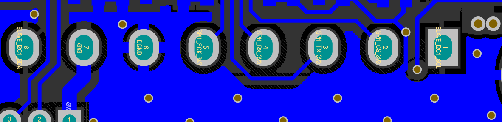

# Mission: Bring Up IMX500 Metadata On Pico

All Pico examples in this directory use the same hardware interface to the
IMX500 camera module:

- `I2C0` for control
- `SPI0` for metadata, JPEG, or tensor data

The same pin mapping is used by:

- `spi_receive_integration_test`
- `micropython_imx500_spi_receive`
- `micropython_imx500_metadata_parse`

## Goal

Wire Raspberry Pi Pico to the IMX500 module once, then validate that the Pico can
control the module over `I2C0` and receive metadata over `SPI0`.

## Hardware

- Raspberry Pi Pico.
- Arducam IMX500 camera module.
- 8-pin IMX500 header wires.
- USB cable for Pico power, flashing, and serial output.

## Run

After wiring, choose the mission that matches your goal:

| Mission | Start with |
| --- | --- |
| Validate native C++ SPI metadata reads | [spi_receive_integration_test](spi_receive_integration_test) |
| Smoke-test the SDK from MicroPython | [micropython_imx500_spi_receive](micropython_imx500_spi_receive/README.md) |
| Parse AI metadata from MicroPython | [micropython_imx500_metadata_parse](micropython_imx500_metadata_parse/README.md) |

For the native C++ SPI receive integration test:

```sh
cd examples/platform/rpi/pico/spi_receive_integration_test
cmake -S . -B build
cmake --build build
```

Flash `build/spi_receive_integration_test.uf2` to Pico.

For the MicroPython versions, build a custom RP2 MicroPython firmware with the
SDK user module, then copy or run the matching `main.py`:

- [micropython_imx500_spi_receive](micropython_imx500_spi_receive/README.md)
- [micropython_imx500_metadata_parse](micropython_imx500_metadata_parse/README.md)

## Expected Feedback

You should see:

- Pico firmware boots and prints serial output over USB.
- IMX500 control succeeds over `I2C0`.
- Metadata can be read over `SPI0`.

## You Passed This Mission When

- The wiring checklist below is complete.
- The example can start the IMX500 stream.
- At least one metadata frame is read.

## If It Fails

- If the camera is not detected, first check `GND`, `3V3`, `SDA`, `SCL`, and `CS`.
- If I2C logs show `ret=-2`, check power, ground, SDA/SCL order, and whether the
  module is present at I2C address `0x0c`.
- If the module powers up but data transfer fails, check whether `SPI_TX` and
  `SPI_RX` were crossed correctly.
- If you changed the wiring, update the corresponding `g_config.h` file for the
  example you are building.
- The example expects both `I2C` and `SPI` to be connected. I2C alone is not enough.

## Next Unlock

- Turn metadata into product events with the [SPI metadata path](../../../../docs/paths/spi-mcu-product-path.md).
- Validate or replace a model with the [model validation mission](../../../../docs/paths/model-validation-to-production.md).
- Move toward production with the [design-in checklist](../../../../docs/production/design-in-checklist.md).

## Wiring Details

### 1. Read the Camera Header First



Based on the hardware image, the camera board exposes an 8-pin header. In the
image orientation, the pins appear in this order from left to right:

| Camera pad | Signal on camera board |
| --- | --- |
| `8` | `I2C SDA` |
| `7` | `+3v3` |
| `6` | `DGND` |
| `5` | `SPI_SCK_3v3` |
| `4` | `SPI_RX_3v3` |
| `3` | `SPI_TX_3v3` |
| `2` | `SPI_CS_3v3` |
| `1` | `I2C SCL` |

Important:

- This left-to-right order is only valid for the same viewing direction as the image.
- If you flip the board or view it from the opposite side, the physical order will appear reversed.
- When wiring by hand, always confirm both the pad number and the signal name on the PCB silk.

### 2. Recommended Pico Wiring

Use the following mapping between the camera board and Pico:

| Camera pad | Camera signal | Pico connection | Pico function |
| --- | --- | --- | --- |
| `8` | `I2C SDA` | `GPIO20` | `I2C0 SDA` |
| `1` | `I2C SCL` | `GPIO21` | `I2C0 SCL` |
| `5` | `SPI_SCK_3v3` | `GPIO18` | `SPI0 SCK` |
| `4` | `SPI_RX_3v3` | `GPIO19` | `SPI0 TX` |
| `3` | `SPI_TX_3v3` | `GPIO16` | `SPI0 RX` |
| `2` | `SPI_CS_3v3` | `GPIO17` | `SPI chip select` |
| `7` | `+3v3` | `3V3(OUT)` | `3.3 V power` |
| `6` | `DGND` | `GND` | Ground |

### 3. Why `SPI_TX` and `SPI_RX` Can Be Confusing

The camera board silk uses `SPI_TX` and `SPI_RX` from the camera side. Pico uses
`SPI0 TX` and `SPI0 RX` from the MCU side. Because of that:

- Pico `TX` must connect to camera `RX`
- Pico `RX` must connect to camera `TX`

So the correct SPI cross-connection is:

- `GPIO19 (Pico SPI0 TX)` -> `camera pad 4 (SPI_RX_3v3)`
- `GPIO16 (Pico SPI0 RX)` -> `camera pad 3 (SPI_TX_3v3)`

If you instead connect `TX -> TX` and `RX -> RX`, SPI communication will not work.

### 4. Wiring Diagram

```text
Pico                           IMX500 camera board
-----------------------------------------------------------
GPIO20  (I2C0 SDA)        ->   Pad 8  (I2C SDA)
GPIO21  (I2C0 SCL)        ->   Pad 1  (I2C SCL)
GPIO18  (SPI0 SCK)        ->   Pad 5  (SPI_SCK_3v3)
GPIO19  (SPI0 TX / MOSI)  ->   Pad 4  (SPI_RX_3v3)
GPIO16  (SPI0 RX / MISO)  <-   Pad 3  (SPI_TX_3v3)
GPIO17  (SPI CS)          ->   Pad 2  (SPI_CS_3v3)
3V3(OUT)                  ->   Pad 7  (+3v3)
GND                       ->   Pad 6  (DGND)
```

### 5. Wiring Checklist

Before powering the board:

1. Connect `GND` first.
2. Connect `3V3(OUT)` to the camera `+3v3` pin.
3. Connect the two I2C lines: `GPIO20 -> SDA` and `GPIO21 -> SCL`.
4. Connect the four SPI lines: `SCK`, `TX -> RX`, `RX -> TX`, and `CS`.
5. Double-check that `3.3 V` is used. Do not feed `5 V` into the camera signal pins.
6. Power Pico through USB only after the wiring is complete.

### 6. Troubleshooting

- If the camera is not detected, first check `GND`, `3V3`, `SDA`, `SCL`, and `CS`.
- If the first I2C reads fail with `ret=-2`, the module is likely not responding
  on the bus. Re-check header orientation, SDA/SCL, common ground, and 3.3 V.
- If the bus is still unreliable, add external pull-ups from `SDA` and `SCL` to
  `3.3 V`, typically around `4.7k`.
- If the module powers up but SPI reads fail, confirm the SPI TX/RX cross-over.
- If you changed the wiring, update the corresponding `g_config.h` file for the
  example you are building.

### 7. Pin Definitions Used by the Current Code

The current Pico example uses:

```c
#define I2C_SDA_PIN 20
#define I2C_SCL_PIN 21
#define SPI_SCK_PIN 18
#define SPI_TX_PIN 19
#define SPI_RX_PIN 16
#define SPI_CSN_PIN 17
```

These definitions are in:

- `examples/platform/rpi/pico/spi_receive_integration_test/g_config.h`
- `examples/platform/rpi/pico/micropython_imx500_spi_receive/g_config.h`
- `examples/platform/rpi/pico/micropython_imx500_metadata_parse/g_config.h`
