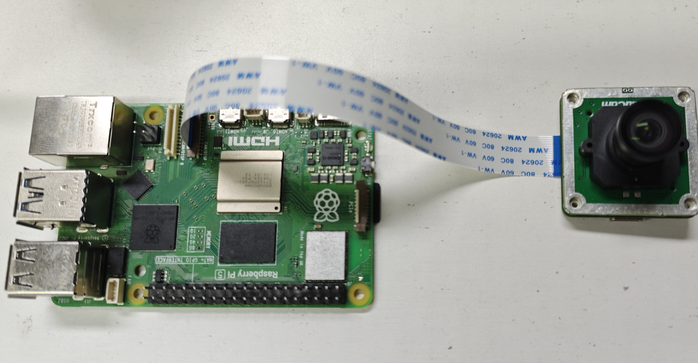
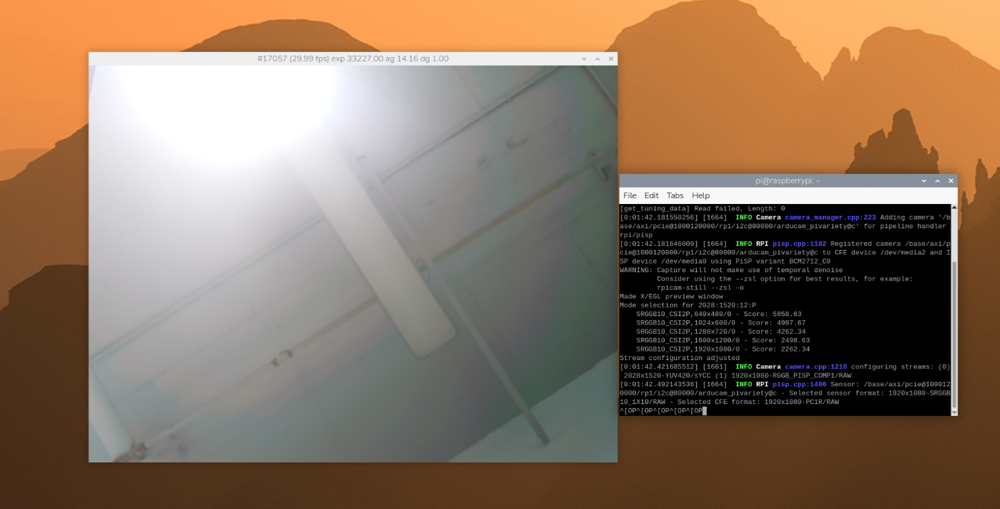

# Mission: Bring Up IMX500 Metadata On RPi5(experimental)


## Get image

Download the Installation Script
```
sudo update
sudo apt install wget -y
wget -O install_pivariety_pkgs.sh https://github.com/ArduCAM/Arducam-Pivariety-V4L2-Driver/releases/download/install_script/install_pivariety_pkgs.sh
chmod +x install_pivariety_pkgs.sh
```
Install Arducam libcamera Software
```
./install_pivariety_pkgs.sh -p libcamera_dev
./install_pivariety_pkgs.sh -p libcamera_apps
```

Open the configuration file:
```
sudo nano /boot/firmware/config.txt
```

Disable camera auto-detection:
```
camera_auto_detect=0
```
Add arducam-pivariety overlay under the [all] section:
```
dtoverlay=arducam-pivariety
```
Save and reboot:
```
sudo reboot
```
Get frame
```
rpicam-still -t 0 --tuning-file /usr/share/libcamera/ipa/rpi/pisp/imx500.json
```



## Get Metadata

See the RPi5 pinout at [https://pinout.xyz/](https://pinout.xyz/).

The `spi_receive_integration_test` project uses the Raspberry Pi 5 40-pin header
through Linux `i2c-dev` and `spidev`:

- I2C control: `/dev/i2c-1`, GPIO2/GPIO3, physical pins `3`/`5`
- SPI metadata: `/dev/spidev0.0`, SPI0 CE0
- SPI mode: `3`, 8-bit words, 5 MHz

### Enable I2C and SPI

Open the configuration file:

```sh
sudo nano /boot/firmware/config.txt
```

Make sure these lines are present:

```text
dtparam=i2c_arm=on
dtparam=spi=on
```

Save and reboot:

```sh
sudo reboot
```

After reboot, check that the device nodes exist:

```sh
ls /dev/i2c-1 /dev/spidev0.0
```

### GPIO Wiring

Based on the Raspberry Pi 5 pinout from pinout.xyz, use SPI0 CE0 on the 40-pin
header.

| Camera pad | Camera signal | RPi5 BCM GPIO | RPi5 physical pin | RPi5 function |
| --- | --- | --- | --- | --- |
| `8` | `I2C SDA` | `GPIO2` | `3` | `I2C1 SDA` |
| `1` | `I2C SCL` | `GPIO3` | `5` | `I2C1 SCL` |
| `5` | `SPI_SCK_3v3` | `GPIO11` | `23` | `SPI0 SCLK` |
| `4` | `SPI_RX_3v3` | `GPIO10` | `19` | `SPI0 MOSI` |
| `3` | `SPI_TX_3v3` | `GPIO9` | `21` | `SPI0 MISO` |
| `2` | `SPI_CS_3v3` | `GPIO8` | `24` | `SPI0 CE0` |
| `7` | `+3v3` | `3V3` | `1` or `17` | `3.3 V power` |
| `6` | `DGND` | `GND` | `6`, `9`, `14`, `20`, `25`, `30`, `34`, or `39` | `Ground` |

The camera board labels `SPI_TX` and `SPI_RX` from the camera side, so the SPI
data lines must be crossed:

- RPi5 `GPIO10 / MOSI` -> camera pad `4 / SPI_RX_3v3`
- RPi5 `GPIO9 / MISO` <- camera pad `3 / SPI_TX_3v3`

Do not connect any camera signal pin to `5 V`. Use `3.3 V` power and common
ground only.

```text
Raspberry Pi 5 40-pin header      IMX500 camera board
--------------------------------------------------------------
Pin 3   GPIO2  (I2C1 SDA)    ->   Pad 8  (I2C SDA)
Pin 5   GPIO3  (I2C1 SCL)    ->   Pad 1  (I2C SCL)
Pin 23  GPIO11 (SPI0 SCLK)   ->   Pad 5  (SPI_SCK_3v3)
Pin 19  GPIO10 (SPI0 MOSI)   ->   Pad 4  (SPI_RX_3v3)
Pin 21  GPIO9  (SPI0 MISO)   <-   Pad 3  (SPI_TX_3v3)
Pin 24  GPIO8  (SPI0 CE0)    ->   Pad 2  (SPI_CS_3v3)
Pin 1   3V3                  ->   Pad 7  (+3v3)
Pin 6   GND                  ->   Pad 6  (DGND)
```

### Build and Run

Install the build tools:

```sh
sudo apt update
sudo apt install cmake g++ -y
```

Build the RPi5 metadata test:

```sh
cd examples/platform/rpi/rpi5/spi_receive_integration_test
cmake -S . -B build
cmake --build build -j
```

To test with a slower SPI clock, configure it at build time:

```sh
cmake -S . -B build -DINTEGRATION_TEST_SPI_BAUDRATE_HZ=1000000
cmake --build build -j
```

Run it on the Raspberry Pi 5:

```sh
sudo ./build/spi_receive_integration_test
```

The default settings live in
`examples/platform/rpi/rpi5/spi_receive_integration_test/g_config.h`.
Change `RPI5_I2C_DEVICE`, `RPI5_SPI_DEVICE`, or `RPI5_SPI_SPEED_HZ` there if
your Pi exposes the bus with different device names or you need a slower SPI
clock.
